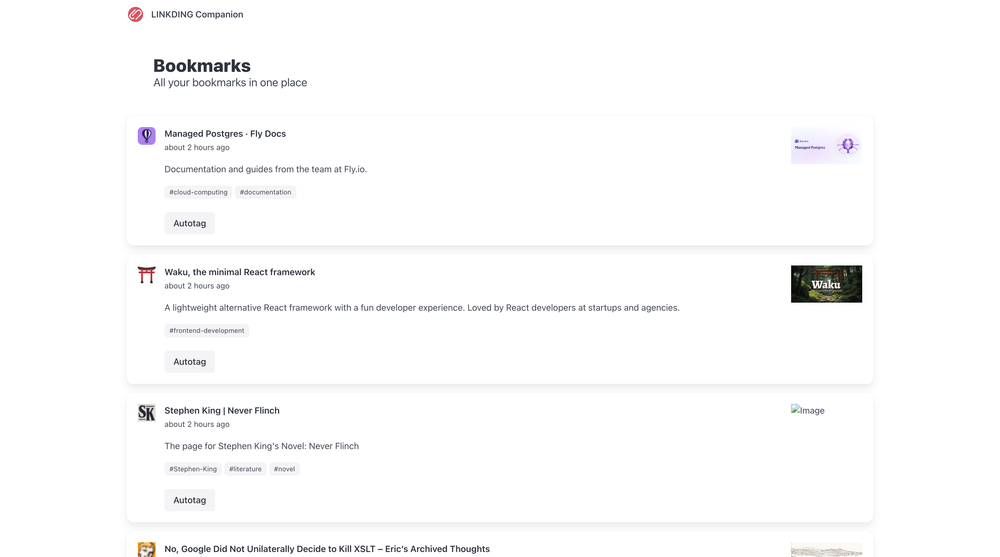

# Linkding Companion

A Ruby on Rails application that provides a companion interface to [Linkding](https://linkding.link/), a self-hosted bookmark manager.



> [!INFO]
> Linkding Companion is a self-hosted application. You can run it on your own server or use the Docker image.
> **It requires a Linkding instance to work.** It has a basic web interface to view bookmarks and tags and kick off processing, but expects you to use Linkding itself to interact with your bookmarks.

## Features

### AI autotagging

AI autotagging automatically tags bookmarks with the appropriate tags. This is useful for clustering bookmarks and for search.

#### Setup

AI autotagging requires an OpenAI API key. To get one:

1. Visit [OpenAI](https://openai.com/)
2. Sign up for an account
3. Create a new API key

> Note: At the time of writing, the gpt-4.1-nano model is used by default. This model is a good balance of speed, accuracy, and cost.

Configure your API key using either method:

##### Option A: Rails Credentials

```bash
rails credentials:edit
```

Add your OpenAI API key:

```yaml
openai:
  api_key: "your-openai-api-key-here"
```

##### Option B: Environment Variables

```bash
export OPENAI_API_KEY="your-openai-api-key-here"
```

#### Usage

This feature runs on all received bookmarks, and will add tags based on the content of the bookmark, including title, description, URL, notes and tags.
If the tagging is overzealous, tags can be removed in bulk in the Linkding Admin UI (`https://your-linkding-instance.com/admin/tags`).

### Content extraction

This feature extracts the content of the bookmark, including title, description, URL, notes and tags. It uses [Readability](https://github.com/mozilla/readability) for this, which
is the same tool used by Firefox to extract content from web pages. Note that this is a Node.js tool, so you will need to have Node.js installed. The default Dockerfile already does this for you.

#### Setup

Ensure that you have a working Node.js installation. The default Dockerfile already does this for you, otherwise the latest Node.js LTS is recommended.
Package installation is not required, as required packages will be installed automatically.

#### Usage

This feature runs on all received bookmarks, and will add the extracted content to the bookmark's notes. It will also upload the extracted content as a bookmark asset named 'content.txt'.

### AI summarisation

This feature automatically generates a summary of the bookmark's content. It uses the extracted content if available, otherwise it uses the description.

#### Setup

AI summarisation requires an OpenAI API key. To get one:

1. Visit [OpenAI](https://openai.com/)
2. Sign up for an account
3. Create a new API key

> Note: At the time of writing, the gpt-4.1-nano model is used by default. This model is a good balance of speed, accuracy, and cost.

Configure your API key using either method:

##### Option A: Rails Credentials

```bash
rails credentials:edit
```

Add your OpenAI API key:

```yaml
openai:
  api_key: "your-openai-api-key-here"
```

##### Option B: Environment Variables

```bash
export OPENAI_API_KEY="your-openai-api-key-here"
```

#### Usage

This feature runs on all received bookmarks, and will add a summary to the bookmark's description.

### Search continuation

Search continuation allows you to bookmark a search URL and have it automatically updated with the most relevant result. This is useful for tracking search results over time or saving searches to check later.

#### Setup

Search continuation requires a Brave Search API key. To get one:

1. Visit [Brave Search API](https://brave.com/search/api/)
2. Sign up to use the Brave Search API (requires an email address)
3. Activate the free subscription (requires a payment method to be added)
4. Request a new API key

> Note: The free tier includes 2,000 searches per month

Configure your API key using either method:

##### Option A: Rails Credentials

```bash
rails credentials:edit
```

Add your Brave Search API key:

```yaml
brave_search:
  api_key: "your-brave-api-key-here"
```

##### Option B: Environment Variables

```bash
export BRAVE_API_KEY="your-brave-api-key-here"
```

For Docker, add the environment variable to your run command:

```bash
docker run -d -p 80:80 \
  -e BRAVE_API_KEY=your-brave-api-key-here \
  -e LINKDING_HOST=https://linkding.example.com \
  -e LINKDING_API_KEY=your-api-key-here \
  -e OPENAI_API_KEY=your-openai-api-key-here \
  -e SECRET_KEY_BASE=your-secret-key-base-here \
  --name linkding_companion ghcr.io/joshmcarthur/linkding_companion:latest
```

#### Usage

1. Create a bookmark in Linkding with a search URL containing a 'q' parameter
   - Example: `https://example.com/search?q=ruby+on+rails`
2. Linkding Companion will automatically:
   - Extract the search query
   - Find the most relevant result using Brave Search
   - Update the bookmark with the result
   - Process it with auto-tagging and other enabled features

## Setup (Docker)

With the following environment variables:

- `LINKDING_HOST` - the URL of your Linkding instance
- `LINKDING_API_KEY` - your Linkding API key
- `OPENAI_API_KEY` - your OpenAI API key
- `SECRET_KEY_BASE` - your secret key base. This is used to encrypt the session cookie. You can generate one with `rails secret` - `docker run --rm -it joshmcarthur/linkding_companion:latest rails secret`

You can run on any port you want, but the default is 80. Linkding runs on port 9090 by default,
so something around that range might be easy to remember.

```bash
docker run -d -p 80:80 -e LINKDING_HOST=https://linkding.example.com -e LINKDING_API_KEY=your-api-key-here -e OPENAI_API_KEY=your-openai-api-key-here -e SECRET_KEY_BASE=your-secret-key-base-here --name linkding_companion ghcr.io/joshmcarthur/linkding_companion:latest
```

## Setup (local)

### 1. Install Dependencies

```bash
bundle install
```

### 2. Configure Linkding API Access

You can configure your Linkding instance connection in two ways:

#### Option A: Rails Credentials (Recommended)

```bash
rails credentials:edit
```

Add your Linkding configuration:

```yaml
linkding:
  host: "https://your-linkding-instance.com"
  api_key: "your-api-key-here"
```

And for the LLM API keys:

```yaml
openai:
  api_key: "your-openai-api-key-here"
```

> Note - by default gpt-4.1-nano is used for the LLM. Anthropic is also supported
> by configuring the `anthropic.api_key` key or `ANTHROPIC_API_KEY` environment variable.

#### Option B: Environment Variables

```bash
export LINKDING_HOST="https://your-linkding-instance.com"
export LINKDING_API_KEY="your-api-key-here"

# LLM
export OPENAI_API_KEY="your-openai-api-key-here"
```

### 3. Get Your Linkding API Key

1. Log into your Linkding instance
2. Go to Settings
3. Find your API token in the "REST API" section

## API Usage

### Basic Usage

```ruby
# Initialize client (uses credentials or ENV vars automatically)
client = LinkdingClient.new

# Or with explicit configuration
client = LinkdingClient.new(
  host: "https://your-linkding-instance.com",
  api_key: "your-api-key"
)
```

### Bookmarks

```ruby
# List bookmarks
bookmarks = client.list_bookmarks(limit: 10)

# Search bookmarks
results = client.list_bookmarks(q: "rails programming")

# Check if URL is bookmarked
check = client.check_bookmark("https://example.com")

# Create bookmark
bookmark = client.create_bookmark({
  url: "https://example.com",
  title: "Example Site",
  description: "A great example",
  tag_names: ["example", "demo"],
  unread: true
})

# Update bookmark
client.update_bookmark(bookmark['id'], {
  title: "Updated Title",
  tag_names: ["example", "updated"]
})

# Archive/unarchive
client.archive_bookmark(bookmark['id'])
client.unarchive_bookmark(bookmark['id'])

# Delete
client.delete_bookmark(bookmark['id'])
```

### Tags

```ruby
# List tags
tags = client.list_tags

# Create tag
tag = client.create_tag(name: "ruby-on-rails")
```

### Bundles

```ruby
# List bundles
bundles = client.list_bundles

# Create bundle
bundle = client.create_bundle({
  name: "Programming Resources",
  search: "programming",
  any_tags: "ruby rails javascript",
  excluded_tags: "outdated"
})

# Update bundle
client.update_bundle(bundle['id'], { name: "Updated Name" })
```

### User Profile

```ruby
profile = client.get_user_profile
puts "Theme: #{profile['theme']}"
```

### Error Handling

```ruby
begin
  client.get_bookmark(99999)
rescue LinkdingClient::NotFoundError => e
  puts "Bookmark not found: #{e.message}"
rescue LinkdingClient::AuthenticationError => e
  puts "Authentication failed: #{e.message}"
rescue LinkdingClient::ValidationError => e
  puts "Validation error: #{e.message}"
rescue LinkdingClient::Error => e
  puts "API error: #{e.message}"
end
```

## API Coverage

The client provides full coverage of the Linkding REST API:

- **Bookmarks**: List, retrieve, create, update, archive, delete
- **Bookmark Assets**: List, retrieve, download, upload, delete
- **Tags**: List, retrieve, create
- **Bundles**: List, retrieve, create, update, delete
- **User**: Get profile

For detailed API documentation, see: https://linkding.link/api/
